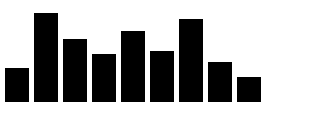

### Introdução
TODO.


### 01 Add Document Elements with D3

D3 has several methods that let you add and change elements in your document.
The select() method selects one element from the document.
The append() method takes an argument for the element you want to add to the document. 
The text() method either sets the text of the selected node, or gets the current text. 

``` html
<body>
  <script>
    d3.select("body")
    .append("h1")
    .text("Learning D3")
  </script>
</body>
```

### 02 Select a Group of Elements with D3

D3 has several methods that let you add and change elements in your document.
D3 also has the selectAll() method to select a group of elements.
Like the select() method, selectAll() supports method chaining, and you can use it with other methods.

``` html
<body>
  <ul>
    <li>Example</li>
    <li>Example</li>
    <li>Example</li>
  </ul>
  <script>
    d3.selectAll("li")
    .text("list item")
  </script>
</body>
```

### 03 Work with Data in D3

The D3 library focuses on a data-driven approach. When you have a set of data, you can apply D3 methods to display it on the page.
The first step is to make D3 aware of the data. The data() method is used on a selection of DOM elements to attach the data to those elements.
A common workflow pattern is to create a new element in the document for each piece of data in the set. D3 has the enter() method for this purpose. 
When enter() is combined with the data() method, it looks at the selected elements from the page and compares them to the number of data items in the set. If there are fewer elements than data items, it creates the missing elements.

``` html
<body>
  <ul></ul>
  <script>
    const dataset = ["a", "b", "c"];
    d3.select("ul").selectAll("li")
      .data(dataset)
      .enter()
      .append("li")
      .text("New item");
  </script>
</body>
```

It may seem confusing to select elements that don't exist yet.
This code is telling D3 to first select the ul on the page.
Next, select all list items, which returns an empty selection.
Then the data() method reviews the dataset and runs the following code three times, once for each item in the array.
The enter() method sees there are no li elements on the page, but it needs 3 (one for each piece of data in dataset).
New li elements are appended to the ul and have the text New item.

### 04 Work with Dynamic Data in D3

The D3 text() method can take a string or a callback function as an argument:

selection.text((d) => d)

In the example above, the parameter d refers to a single entry in the dataset that a selection is bound to.

``` html
<body>
  <script>
    const dataset = [12, 31, 22, 17, 25, 18, 29, 14, 9];
    d3.select("body").selectAll("h2")
      .data(dataset)
      .enter()
      .append("h2")
      .text((d, i) => d + " USD");
  </script>
</body>
```

### 05 Add Inline Styling to Elements

D3 lets you add inline CSS styles on dynamic elements with the style() method.
The style() method takes a comma-separated key-value pair as an argument. Here's an example to set the selection's text color to blue:

``` html
<body>
  <script>
    const dataset = [12, 31, 22, 17, 25, 18, 29, 14, 9];
    d3.select("body").selectAll("h2")
      .data(dataset)
      .enter()
      .append("h2")
      .text((d) => (d + " USD"))
      .style("color", "blue")
  </script>
</body>
```

### 06 Change Styles Based on Data

It's likely you'll want to change the styling of elements based on the data. For example, you may want to color a data point blue if it has a value less than 20, and red otherwise.

```html
<body>
  <script>
    const dataset = [12, 31, 22, 17, 25, 18, 29, 14, 9];
    d3.select("body").selectAll("h2")
      .data(dataset)
      .enter()
      .append("h2")
      .text((d) => (d + " USD"))
      .style("color", (d) => {
        if (d < 20) {
          return "red"
        }
        else {
          return "green"
          }
      });
  </script>
</body>
```

### 07 Add Classes with D3

D3 has the attr() method to add any HTML attribute to an element, including a class name.

The attr() method works the same way that style() does. It takes comma-separated values, and can use a callback function. Here's an example to add a class of container to a selection:

```html
<style>
  .bar {
    width: 25px;
    height: 100px;
    display: inline-block;
    background-color: blue;
  }
</style>
<body>
  <script>
    const dataset = [12, 31, 22, 17, 25, 18, 29, 14, 9];
    d3.select("body").selectAll("div")
      .data(dataset)
      .enter()
      .append("div")
      .attr("class", "bar")
  </script>
</body>
```

### 08 Update the Height of an Element Dynamically

Create a `div` for each data point in the array
Give each `div` a dynamic `height`, using a callback function in the `style()` method that sets height equal to the data value.

```html
<style>
  .bar {
    width: 25px;
    height: 100px;
    display: inline-block;
    background-color: blue;
  }
</style>
<body>
  <script>
    const dataset = [12, 31, 22, 17, 25, 18, 29, 14, 9];
    d3.select("body").selectAll("div")
      .data(dataset)
      .enter()
      .append("div")
      .attr("class", "bar")
      .style("height", (d) => d)
  </script>
</body>
```



### 09 Change the Presentation of a Bar Chart

The last challenge created a bar chart, but there are a couple of formatting changes that could improve it:
* Add space between each bar to visually separate them, which is done by adding a margin to the CSS for the bar class
* Increase the height of the bars to better show the difference in values, which is done by multiplying the value by a number to scale the height

```html
<style>
  .bar {
    width: 25px;
    height: 100px;
    margin: 2px;
    display: inline-block;
    background-color: blue;
  }
</style>
<body>
  <script>
    const dataset = [12, 31, 22, 17, 25, 18, 29, 14, 9];
    d3.select("body").selectAll("div")
      .data(dataset)
      .enter()
      .append("div")
      .attr("class", "bar")
      .style("height", (d) => (d * 10 + "px"))
  </script>
</body>
```


### 10 Learn About SVG in D3

SVG stands for Scalable Vector Graphics.

Here "scalable" means that, if you zoom in or out on an object, it would not appear pixelated. It scales with the display system, whether it's on a small mobile screen or a large TV monitor.

SVG is used to make common geometric shapes. Since D3 maps data into a visual representation, it uses SVG to create the shapes for the visualization. SVG shapes for a web page must go within an HTML svg tag.

CSS can be scalable when styles use relative units (such as vh, vw, or percentages), but using SVG is more flexible to build data visualizations.

``` html
<style>
  svg {
    background-color: pink;
  }
</style>
<body>
  <script>
    const dataset = [12, 31, 22, 17, 25, 18, 29, 14, 9];
    const w = 500;
    const h = 100;
    const svg = d3.select("body")
    .append("svg")
    .style("width", w)
    .style("height", h)
  </script>
</body>
```


### 11 Display Shapes with SVG

The next step is to create a shape to put in the svg area. There are a number of supported shapes in SVG, such as rectangles and circles. They are used to display data. For example, a rectangle `<rect>` SVG shape could create a bar in a bar chart.

When you place a shape into the svg area, you can specify where it goes with x and y coordinates. The origin point of (0, 0) is in the upper-left corner. Positive values for x push the shape to the right, and positive values for y push the shape down from the origin point.

To place a shape in the middle of the 500 (width) x 100 (height) svg from last challenge, the x coordinate would be 250 and the y coordinate would be 50.

An SVG rect has four attributes. There are the x and y coordinates for where it is placed in the svg area. It also has a height and width to specify the size.

``` html
<body>
  <script>
    const dataset = [12, 31, 22, 17, 25, 18, 29, 14, 9];
    const w = 500;
    const h = 100;
    const svg = d3.select("body")
                  .append("svg")
                  .attr("width", w)
                  .attr("height", h)
                  .append("rect")
                  .attr("width", 25)
                  .attr("height",100)
                  .attr("x",0)
                  .attr("y",0);
  </script>
</body>
```


### 12 Create a Bar for Each Data Point in the Set

The last challenge added only one rectangle to the svg element to represent a bar. Here, you'll combine what you've learned so far about data(), enter(), and SVG shapes to create and append a rectangle for each data point in dataset.

There are a few differences working with rect elements instead of div elements. The rect elements must be appended to an svg element, not directly to the body. Also, you need to tell D3 where to place each rect within the svg area. The bar placement will be covered in the next challenge.

``` html
<body>
  <script>
    const dataset = [12, 31, 22, 17, 25, 18, 29, 14, 9];

    const w = 500;
    const h = 100;

    const svg = d3.select("body")
                  .append("svg")
                  .attr("width", w)
                  .attr("height", h);

    svg.selectAll("rect")
       .data(dataset)
       .enter()
       .append("rect")
       .attr("x", 0)
       .attr("y", 0)
       .attr("width", 25)
       .attr("height", 100);
  </script>
</body>
```


### 13 Dynamically Set the Coordinates for Each Bar

For a bar chart, all of the bars should sit on the same vertical level, which means the y value stays the same (at 0) for all bars. The x value, however, needs to change as you add new bars. Remember that larger x values push items farther to the right. As you go through the array elements in dataset, the x value should increase.

The attr() method in D3 accepts a callback function to dynamically set that attribute. The callback function takes two arguments, one for the data point itself (usually d) and one for the index of the data point in the array

It's important to note that you do NOT need to write a for loop or use forEach() to iterate over the items in the data set. Recall that the data() method parses the data set, and any method that's chained after data() is run once for each item in the data set.

``` html
<body>
  <script>
    const dataset = [12, 31, 22, 17, 25, 18, 29, 14, 9];

    const w = 500;
    const h = 100;

    const svg = d3.select("body")
                  .append("svg")
                  .attr("width", w)
                  .attr("height", h);

    svg.selectAll("rect")
       .data(dataset)
       .enter()
       .append("rect")
       .attr("x", (d, i) => i * 30)
       .attr("y", 0)
       .attr("width", 25)
       .attr("height", 100);
  </script>
</body>
```


### 14 Dynamically Change the Height of Each Bar

The height of each bar can be set to the value of the data point in the array, similar to how the x value was set dynamically.

``` html
<body>
  <script>
    const dataset = [12, 31, 22, 17, 25, 18, 29, 14, 9];

    const w = 500;
    const h = 100;

    const svg = d3.select("body")
                  .append("svg")
                  .attr("width", w)
                  .attr("height", h);

    svg.selectAll("rect")
       .data(dataset)
       .enter()
       .append("rect")
       .attr("x", (d, i) => i * 30)
       .attr("y", 0)
       .attr("width", 25)
       .attr("height", (d, i) => d * 3);
  </script>
</body>
```


### 15 Invert SVG Elements

In SVG, the origin point for the coordinates is in the upper-left corner. An x coordinate of 0 places a shape on the left edge of the SVG area. A y coordinate of 0 places a shape on the top edge of the SVG area. Higher x values push the rectangle to the right. Higher y values push the rectangle down.

The y coordinate that is y = heightOfSVG - heightOfBar would place the bars right-side-up.

Note: In general, the relationship is y = h - m * d, where m is the constant that scales the data points.

``` html
<body>
  <script>
    const dataset = [12, 31, 22, 17, 25, 18, 29, 14, 9];

    const w = 500;
    const h = 100;

    const svg = d3.select("body")
                  .append("svg")
                  .attr("width", w)
                  .attr("height", h);

    svg.selectAll("rect")
       .data(dataset)
       .enter()
       .append("rect")
       .attr("x", (d, i) => i * 30)
       .attr("y", (d, i) => h - 3 * d)
       .attr("width", 25)
       .attr("height", (d, i) => 3 * d);
  </script>
</body>
```


### 16 Change the Color of an SVG Element

In SVG, a rect shape is colored with the fill attribute. It supports hex codes, color names, and rgb values, as well as more complex options like gradients and transparency.

``` html
<body>
  <script>
    const dataset = [12, 31, 22, 17, 25, 18, 29, 14, 9];

    const w = 500;
    const h = 100;

    const svg = d3.select("body")
                  .append("svg")
                  .attr("width", w)
                  .attr("height", h);

    svg.selectAll("rect")
       .data(dataset)
       .enter()
       .append("rect")
       .attr("x", (d, i) => i * 30)
       .attr("y", (d, i) => h - 3 * d)
       .attr("width", 25)
       .attr("height", (d, i) => 3 * d)
       .attr("fill", "navy")
  </script>
</body>
```


### 17 Add Labels to D3 Elements

D3 lets you label a graph element, such as a bar, using the SVG text element.

Like the rect element, a text element needs to have x and y attributes, to place it on the SVG. It also needs to access the data to display those values.

``` html
<body>
  <script>
    const dataset = [12, 31, 22, 17, 25, 18, 29, 14, 9];

    const w = 500;
    const h = 200;

    const svg = d3.select("body")
                  .append("svg")
                  .attr("width", w)
                  .attr("height", h);

    svg.selectAll("rect")
       .data(dataset)
       .enter()
       .append("rect")
       .attr("x", (d, i) => i * 30)
       .attr("y", (d, i) => h - 3 * d)
       .attr("width", 25)
       .attr("height", (d, i) => 3 * d)
       .attr("fill", "navy");

    svg.selectAll("text")
       .data(dataset)
       .enter()
       .append("text")
       .attr("x", (d, i) => i * 30)
       .attr("y", (d, i) => h - 3 * d - 3)
       .text((d) => d)
  </script>
<body>
```


### 18 Style D3 Labels

D3 methods can add styles to the bar labels. The fill attribute sets the color of the text for a text node. The style() method sets CSS rules for other styles, such as font-family or font-size.

``` html
<body>
  <script>
    const dataset = [12, 31, 22, 17, 25, 18, 29, 14, 9];

    const w = 500;
    const h = 100;

    const svg = d3.select("body")
                  .append("svg")
                  .attr("width", w)
                  .attr("height", h);

    svg.selectAll("rect")
       .data(dataset)
       .enter()
       .append("rect")
       .attr("x", (d, i) => i * 30)
       .attr("y", (d, i) => h - 3 * d)
       .attr("width", 25)
       .attr("height", (d, i) => d * 3)
       .attr("fill", "navy");

    svg.selectAll("text")
       .data(dataset)
       .enter()
       .append("text")
       .text((d) => d)
       .attr("x", (d, i) => i * 30)
       .attr("y", (d, i) => h - (3 * d) - 3)
       .style("font-size", "25px")
       .attr("fill", "red")
  </script>
</body>
```


### 19 Add a Hover Effect to a D3 Element

It's possible to add effects that highlight a bar when the user hovers over it with the mouse. So far, the styling for the rectangles is applied with the built-in D3 and SVG methods, but you can use CSS as well.

You set the CSS class on the SVG elements with the attr() method. Then the :hover pseudo-class for your new class holds the style rules for any hover effects.

``` html
<style>
  .bar:hover {
    fill: brown;
  }
</style>
<body>
  <script>
    const dataset = [12, 31, 22, 17, 25, 18, 29, 14, 9];

    const w = 500;
    const h = 100;

    const svg = d3.select("body")
                  .append("svg")
                  .attr("width", w)
                  .attr("height", h);

    svg.selectAll("rect")
       .data(dataset)
       .enter()
       .append("rect")
       .attr("x", (d, i) => i * 30)
       .attr("y", (d, i) => h - 3 * d)
       .attr("width", 25)
       .attr("height", (d, i) => 3 * d)
       .attr("fill", "navy")
       .attr("class", "bar")

    svg.selectAll("text")
       .data(dataset)
       .enter()
       .append("text")
       .text((d) => d)
       .attr("x", (d, i) => i * 30)
       .attr("y", (d, i) => h - (3 * d) - 3);
  </script>
</body>
```


### 20 Add a Tooltip to a D3 Element

A tooltip shows more information about an item on a page when the user hovers over that item. There are several ways to add a tooltip to a visualization. This challenge uses the SVG title element.

title pairs with the text() method to dynamically add data to the bars.

``` html
<style>
  .bar:hover {
    fill: brown;
  }
</style>
<body>
  <script>
    const dataset = [12, 31, 22, 17, 25, 18, 29, 14, 9];

    const w = 500;
    const h = 100;

    const svg = d3.select("body")
                  .append("svg")
                  .attr("width", w)
                  .attr("height", h);

    svg.selectAll("rect")
       .data(dataset)
       .enter()
       .append("rect")
       .attr("x", (d, i) => i * 30)
       .attr("y", (d, i) => h - 3 * d)
       .attr("width", 25)
       .attr("height", (d, i) => d * 3)
       .attr("fill", "navy")
       .attr("class", "bar")
       .append("title")
       .text((d) => d)

    svg.selectAll("text")
       .data(dataset)
       .enter()
       .append("text")
       .text((d) => d)
       .attr("x", (d, i) => i * 30)
       .attr("y", (d, i) => h - (d * 3 + 3))
  </script>
</body>
```


### 21 Create a Scatterplot with SVG Circles

A scatter plot is another type of visualization. It usually uses circles to map data points, which have two values each. These values tie to the x and y axes, and are used to position the circle in the visualization.

SVG has a circle tag to create the circle shape. It works a lot like the rect elements you used for the bar chart.

``` html
<body>
  <script>
    const dataset = [
                  [ 34,    78 ],
                  [ 109,   280 ],
                  [ 310,   120 ],
                  [ 79,    411 ],
                  [ 420,   220 ],
                  [ 233,   145 ],
                  [ 333,   96 ],
                  [ 222,   333 ],
                  [ 78,    320 ],
                  [ 21,    123 ]
                ];


    const w = 500;
    const h = 500;

    const svg = d3.select("body")
                  .append("svg")
                  .attr("width", w)
                  .attr("height", h);

    svg.selectAll("circle")
       .data(dataset)
       .enter()
       .append("circle")
  </script>
</body>
```

### 22 Add Attributes to the Circle Elements

A circle in SVG has three main attributes. The cx and cy attributes are the coordinates. They tell D3 where to position the center of the shape on the SVG. The radius (r attribute) gives the size of the circle.

Just like the rect y coordinate, the cy attribute for a circle is measured from the top of the SVG, not from the bottom.

All three attributes can use a callback function to set their values dynamically. Remember that all methods chained after data(dataset) run once per item in dataset. The d parameter in the callback function refers to the current item in dataset, which is an array for each point. You use bracket notation, like d[0], to access the values in that array.

``` html
<body>
  <script>
    const dataset = [
                  [ 34,    78 ],
                  [ 109,   280 ],
                  [ 310,   120 ],
                  [ 79,    411 ],
                  [ 420,   220 ],
                  [ 233,   145 ],
                  [ 333,   96 ],
                  [ 222,   333 ],
                  [ 78,    320 ],
                  [ 21,    123 ]
                ];


    const w = 500;
    const h = 500;

    const svg = d3.select("body")
                  .append("svg")
                  .attr("width", w)
                  .attr("height", h);

    svg.selectAll("circle")
       .data(dataset)
       .enter()
       .append("circle")
       .attr("cx", (d) => d[0])
       .attr("cy", (d) => h - d[1])
       .attr("r", 5)
  </script>
</body>
```


### 23 Add Labels to Scatter Plot Circles

The goal is to display the comma-separated values for the first (x) and second (y) fields of each item in dataset.

The text nodes need x and y attributes to position it on the SVG. In this challenge, the y value (which determines height) can use the same value that the circle uses for its cy attribute. The x value can be slightly larger than the cx value of the circle, so the label is visible. This will push the label to the right of the plotted point.

``` html
<body>
  <script>
    const dataset = [
                  [ 34,    78 ],
                  [ 109,   280 ],
                  [ 310,   120 ],
                  [ 79,    411 ],
                  [ 420,   220 ],
                  [ 233,   145 ],
                  [ 333,   96 ],
                  [ 222,   333 ],
                  [ 78,    320 ],
                  [ 21,    123 ]
                ];


    const w = 500;
    const h = 500;

    const svg = d3.select("body")
                  .append("svg")
                  .attr("width", w)
                  .attr("height", h);

    svg.selectAll("circle")
       .data(dataset)
       .enter()
       .append("circle")
       .attr("cx", (d, i) => d[0])
       .attr("cy", (d, i) => h - d[1])
       .attr("r", 5);

    svg.selectAll("text")
       .data(dataset)
       .enter()
       .append("text")
       .text((d) => d[0] + ", " + d[1])
       .attr("x", (d) => d[0] + 5)
       .attr("y", (d) => h - d[1])
  </script>
</body>
```


### 24 Create a Linear Scale with D3

The bar and scatter plot charts both plotted data directly onto the SVG. However, if the height of a bar or one of the data points were larger than the SVG height or width values, it would go outside the SVG area.

In D3, there are scales to help plot data. scales are functions that tell the program how to map a set of raw data points onto the pixels of the SVG.

For example, say you have a 100x500-sized SVG and you want to plot Gross Domestic Product (GDP) for a number of countries. The set of numbers would be in the billion or trillion-dollar range. You provide D3 a type of scale to tell it how to place the large GDP values into that 100x500-sized area.

It's unlikely you would plot raw data as-is. Before plotting it, you set the scale for your entire data set, so that the x and y values fit your SVG width and height.

D3 has several scale types. For a linear scale (usually used with quantitative data), there is the D3 method scaleLinear():
const scale = d3.scaleLinear()

``` html
<body>
  <script>
    
    const scale = d3.scaleLinear(); 
    const output = scale(50); 
    
    d3.select("body")
      .append("h2")
      .text(output);

  </script>
</body>
```

### 25 Set a Domain and a Range on a Scale
